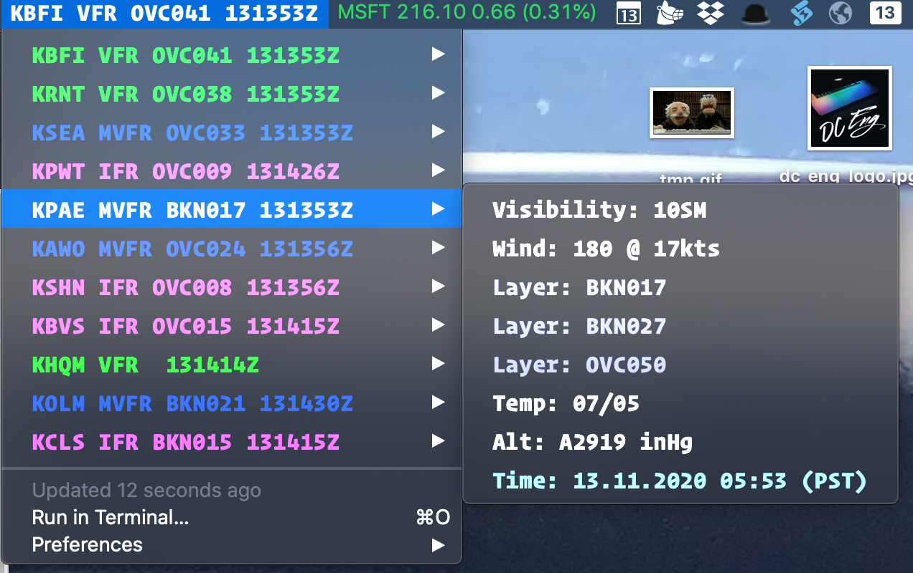
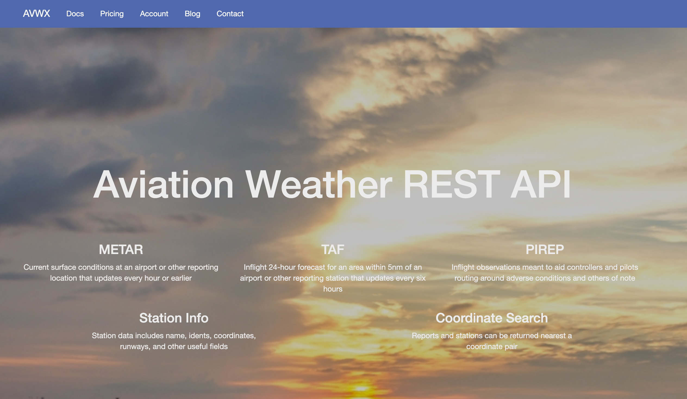
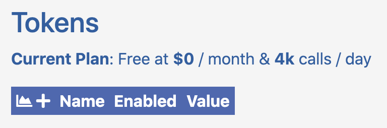

# metar-bitbar
A MacOSX Bitbar for Metars



Bitbar is a pretty great and kinda finicky platform for adding menu items to Mac OSX. As a student pilot, I really wanted a great METAR menu that gives me some visual cues to the current condition of my own airport and a easy way to add additional airports using JavaScript. There's already a METAR plugin out there, but written in Ruby which is also finicky and I wanted something easy to modify. The code sucks - for gosh sakes, this is just a fun project for me to help me with my student pilotage. Enjoy, feel free to modify and hopefully my instructions are good. I'll take ANY enhancements, and if you find a bug or something that could make it better, instead of reporting it, create a PR. JavaScript is easy - no excuse to ask me to fix it. It's one file of code, for gosh sakes.

## Installation

You need to take some steps here, such as modifying variables at the top of the file, grabbing an authorization key from the METAR web service site, etc.

#### Install Bitbar

Follow the instructions here: https://github.com/matryer/bitbar 

### Copy or download the `aweather.5m.js` from this repo

You will end up placing this file in the BitBar folder. After installing BitBar, you can find the folder usually in `~/Documents/BitBar` - There are instructions in the BitBar site about this.

### Sign up for an account at `https://avwx.rest/`



AVWX REST API is a website to deliver JSON output of weather information. There are free and professional tiers. This BitBar only requires the free tier, however, you need to sign up for an account. Additionally, that account will need a token.

1. Navigate to `https://avwx.rest/`
2. Click on `Account`
3. Click on `New Here: Register`
4. Create a username and password.
5. Log Into Your Account (note you probably need to verify the account through e-mail).
6. Confirm that it has you set up for **Hobby** level (FREE).
7. Under TOKENS: click the `+` key and a token will be created.

8. Copy the created token. You will use this **token** in the JavaScript file. Example token: `p6gZKCQCZo4fSUfgimKWa3sLFWLH27oBS5sy_999999`

### Copy and Prep the `aweather.5m.js` file.

Ok, so, now hopefully this is an easy task to setup. Follow these instructions exactly. NOTE: You must have `nodejs` installed here with `npm`.

1. Install `nodejs`: `brew install node`
2. Open a terminal and navigate to the BitBar directory (maybe: `~/Documents/BitBar`
3. Copy the `aweather.5m.js` file into this folder.
4. In the terminal at this location, type: `npm install bitbar` - this will create a `node_modules` folder in your current location. This is ok, and required.
5. In the terminal at this location, type: `npm install node-fetch`
6. In the terminal at this location, type: `npm install date-fns-tz`
7. When completed installing, remove (delete) `package.json` from the folder as BitBar will probably think this is a plugin and will show a warning icon on the menu bar. It's ok, you don't need it to run the file.
8. Type `where node` and note the return values. You'll need this to properly modify the file below to where it runs `node`. Example value: `/Users/<your-user-name>/.nvm/versions/node/v10.15.0/bin/node`

### Modify the `aweather.5m.js`

OK: Here comes the fun part, modifying the file.

1. Open `aweather.5m.js` in your favorite editor.

2. Modify the first line:
```
#!/usr/bin/env /Users/<your-user-name>/.nvm/versions/node/v10.15.0/bin/node
```
and replace the portion that starts with `/Users` with the value above from the `where node` command.

3. Modify the token:
```
const token = '<your-token-here';
```
Insert the token in the quotes with the value you got from `AVWX.rest`

4. Update your airports!
```
const airports = ['KBFI', 'KRNT', 'KSEA', 'KPWT', 'KPAE', 'KAWO', 'KSHN', 'KBVS', 'KHQM', 'KOLM', 'KCLS'];
```
Add as many airports as you want here.

5. Update your timezone
```
const timeZone = 'America/Los_Angeles';
```
Update your timezone code here for a submenu with the METAR time adjusted from Zulu. For the proper string for your timezone: https://en.wikipedia.org/wiki/List_of_tz_database_time_zones

### OK! Running it.

You should now be ready to go. Run BitBar. Something should show up in the bar now with your first airport being the menu item. If you get a yellow caution icon, that means you have something incorrectly configured. Try my instructions again. NOTE: Clicking on the yellow icon should show an exception and tell you what's wrong.
